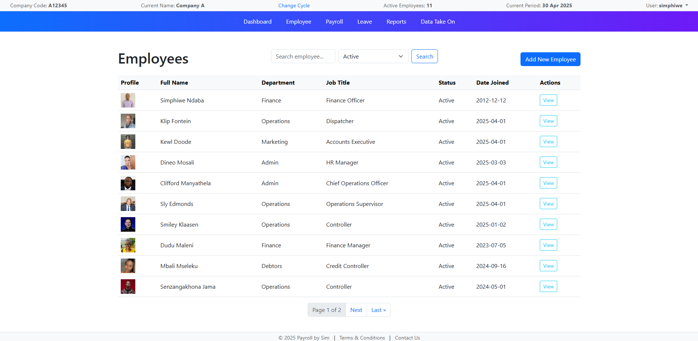

# Employee Management System

A Django-based web application to manage employee records for payroll purposes. The system supports both salaried and wage-based employees and provides an intuitive interface for HR operations like adding, viewing, editing, and updating employee statuses.

## 🚀 Features

### 👤 Employee Management
- Add new employees using a form with:
  - First Name
  - Last Name
  - ID Number
  - Tax Number (optional)
  - Department and Job Title (optional)
  - Profile Picture (optional)
  - Salary and/or Hourly Rate
  - Wage Employee flag
  - Employment Status (Active, Suspended, Terminated, On Leave, Deceased, Retired, Maternity Leave, Probation, Resigned)

- View an employee’s details:
  - Displays profile picture, personal info, department, job title, and compensation
  - Automatically calculates and displays hourly rate if salary is provided and employee is not a wage earner

- Edit an employee:
  - Modal-based edit form integrated into the employee detail page

- List all employees:
  - Landing page displaying all employee records with key information

### ⚙️ Compensation Logic
- Wage employees must have an hourly rate (default is 0 if not specified)
- Salaried employees have their hourly rate calculated automatically based on:
  - Custom working hours configuration (if set)
  - Fallback default: 45 hours per week, converted to 4.33 weeks per month

### 💼 Payroll and Payslip Generation
- Payroll Runs:
  - The system generates payroll runs based on the start and end dates of the payroll period.

- Payslips:
  - Automatically generated for both salaried and wage employees at the end of each payroll run.
  - For wage employees, gross income is calculated based on hours worked, including normal, overtime, Saturday, and Sunday/public holiday hours.
  - For salaried employees, gross income is based on the employee's salary.
- Tax Calculation:
  - Monthly tax is calculated based on annualized income, which considers Year-To-Date (YTD) totals and the current month's earnings.
- UIF and SDL:
  - UIF (Unemployment Insurance Fund) contributions are calculated with a ceiling of R17,712 and a 1% rate.
  - SDL (Skills Development Levy) is calculated at 1% of the gross income.
- Net Pay:
  - Automatically calculated by subtracting tax, UIF, and SDL from the gross income.

### 📅 Employment Status Tracking
- Employment status field:
  - Active
  - Terminated

- `status_changed_at` timestamp:
  - Automatically updates when employment status changes

### ✅ UX Enhancements
- Success messages via Django messages framework
- Smart redirection to relevant views (e.g., detail view after employee creation)

## 🖼️ Templates
- `employee_list.html`: Displays all employees
- `employee_detail.html`: Shows individual employee details and includes an edit modal
- `edit_employee_modal.html`: Modal form used for updating employee records
- `payslip_summary.html`: Displays payslip summary for the payroll run, showing gross income, tax, UIF, SDL, and net pay for each employee

## 🔧 Models Summary

### `Employee`
- Fields: `first_name`, `last_name`, `id_number`, `tax_number`, `salary`, `is_wage_employee`, `hourly_rate`, `profile_picture`, `department`, `job_title`, `status`, `status_changed_at`
- Logic:
  - Auto-calculate hourly rate for salaried employees
  - Track changes to employment status with timestamp

## 📦 Requirements
- Django
- Bootstrap (for modal support)
- Pillow (for image uploads)
- Humanize (for formatting numbers)

## 📸 Media
Uploaded profile pictures are stored in `media/employee_pictures/`.

## 🚧 Future Enhancements
- Audit trail for status changes
- Search and filter functionality on the employee list
- Soft delete for terminated employees
- Role-based access control (e.g., Admin vs HR roles)

---

## 📝 License
[MIT](LICENSE)

## 📝 Screenshots

